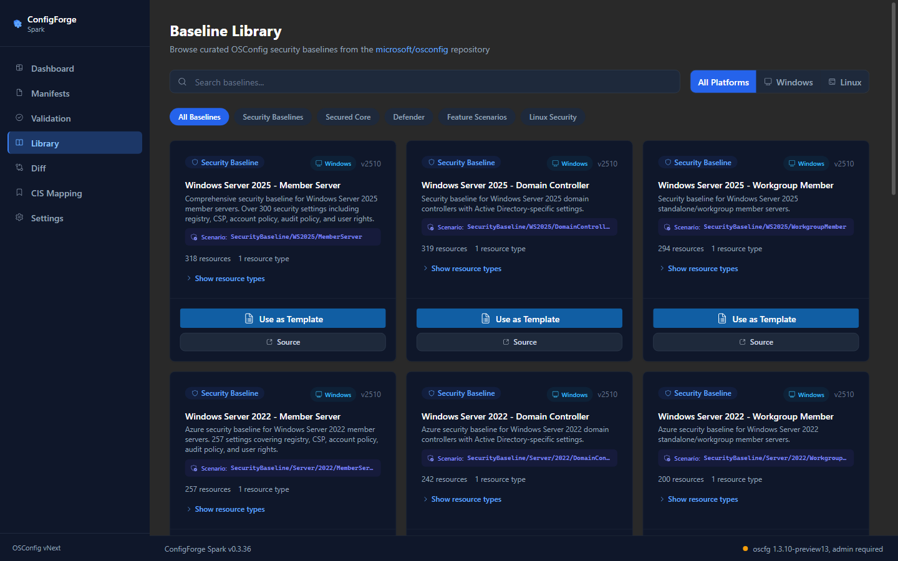
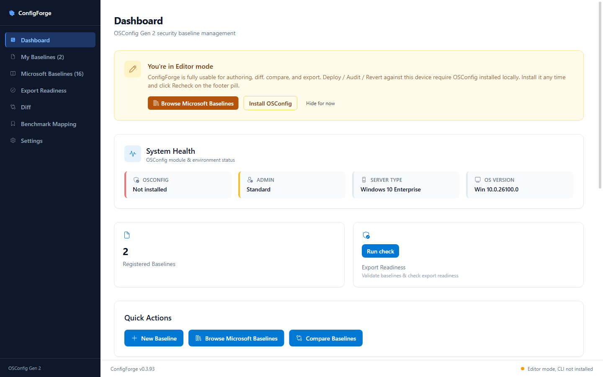
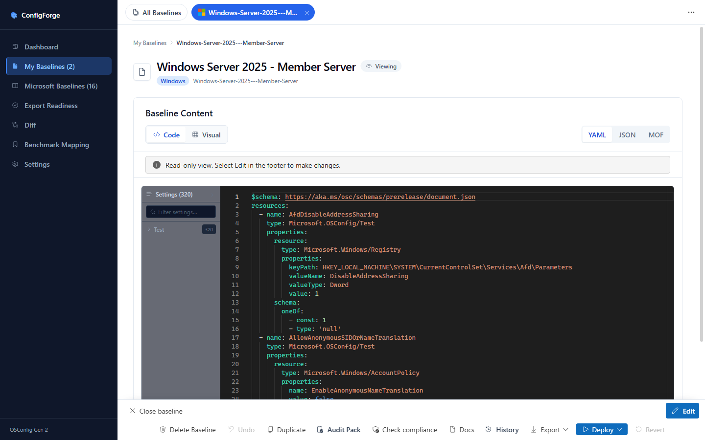
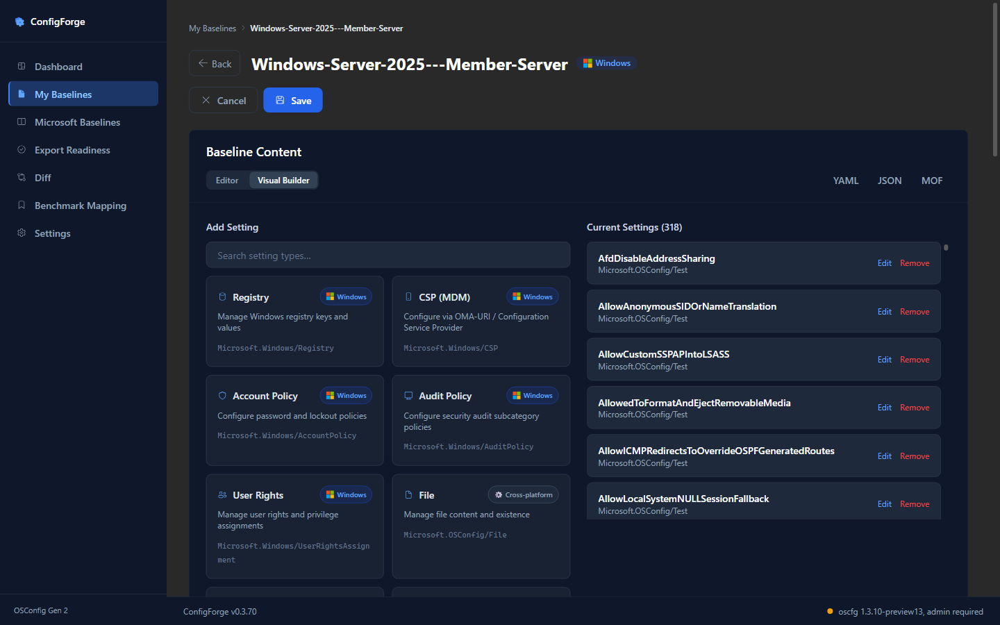
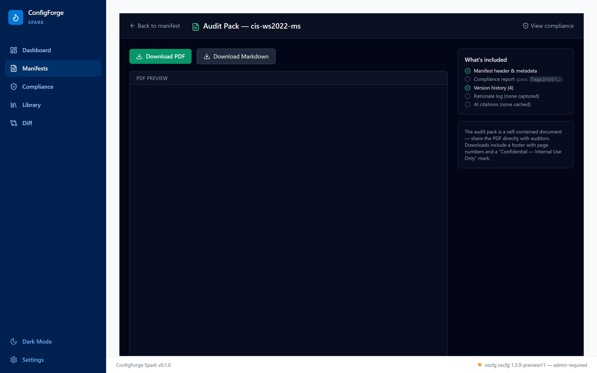
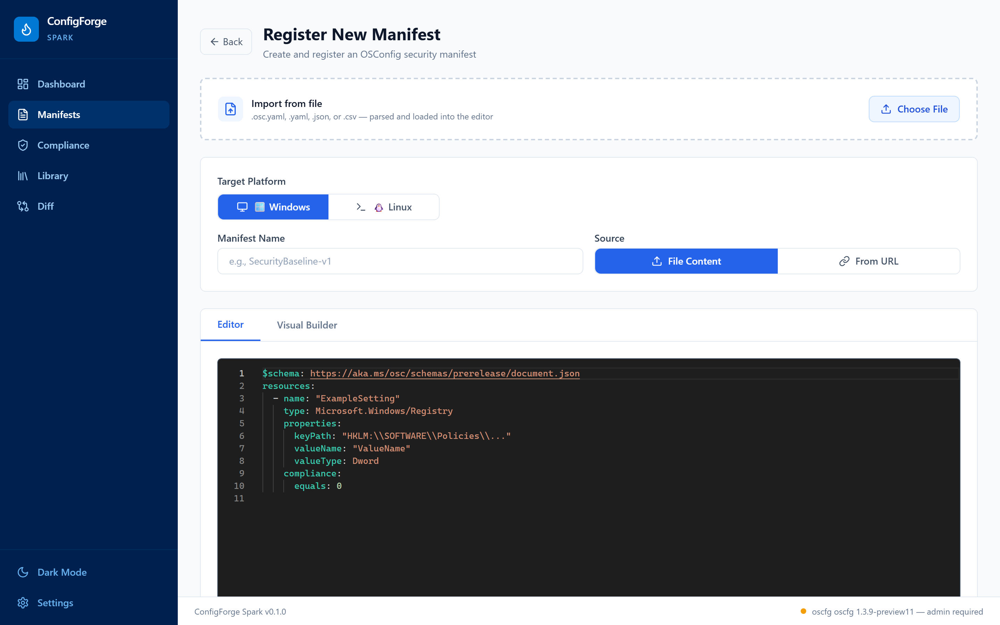
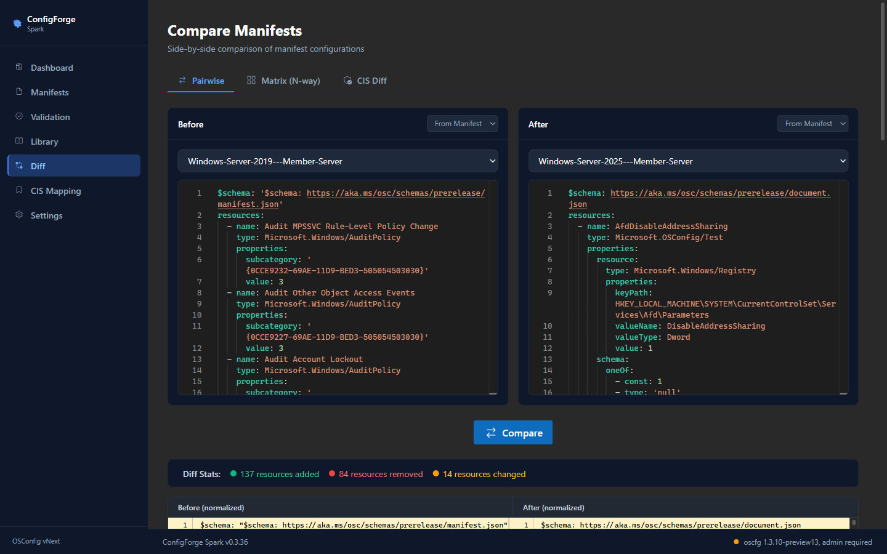
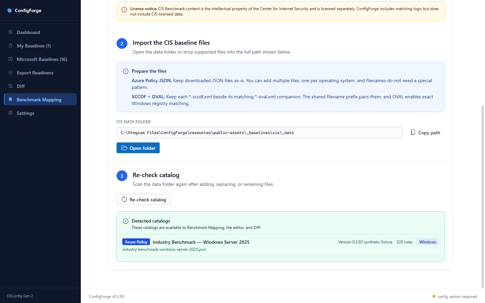
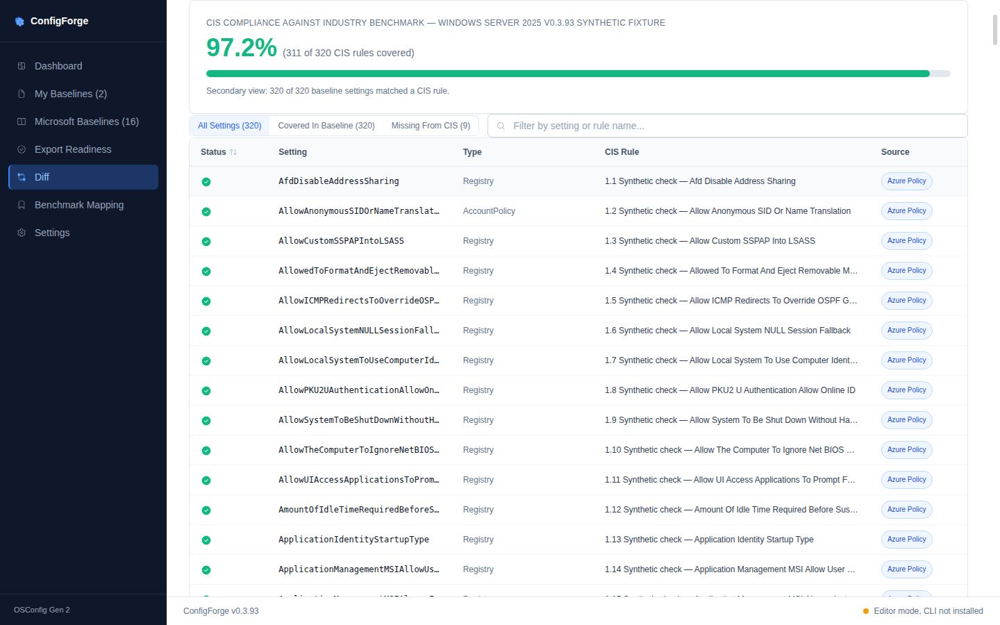

# ConfigForge

> ⚠️ **Disclaimer:** This tool is provided as-is without Microsoft support. This is an experimental project to help customers accelerate their use of security baselines while helping IT architects validate desired configurations. ConfigForge is **not** an officially supported Microsoft product. **Not intended for production use** — for experimentation, learning, and community contributions only. **Use at your own risk.**

**Cross-platform OSConfig security baseline authoring desktop app.** Electron 42 + React 18 + FluentUI v9 + Vite. Windows + Linux use the full build from `main`; macOS uses the author-only flavor from `mac-author-build`. Author, validate, compare, and export on every supported edition. Device deploy and audit are Full-edition features that use the native [`oscfg`](https://github.com/microsoft/osconfig/tree/main/docs/cli) CLI on Windows or Linux.

> The `oscfg` binary is **not** bundled. Editor, Microsoft Baselines, Diff, Benchmark Mapping, and Audit Pack PDF/Markdown export all work without it, including in the macOS Author edition. Deploy, device Audit, and Revert require the Full edition and the CLI. See [`INSTALL.md`](./INSTALL.md) for platform-by-platform install steps.

The current Windows/Linux Full-edition tagged source is `v0.3.96`. The
current macOS Author tagged source is `mac-v0.3.96-author.1`. Both matching
GitHub releases remain unpublished drafts. The Full-edition package version
on `main` is `0.3.96`; the macOS Author package version is `0.3.96-author.1`.

The macOS Author release ports applicable documentation-accuracy corrections
from `main` PR [#97](https://github.com/Azure/ConfigForge/pull/97) via PR
[#99](https://github.com/Azure/ConfigForge/pull/99), and replaces unreliable
native HTML hover titles with FluentUI tooltips on the My Baselines status
cells via PR [#101](https://github.com/Azure/ConfigForge/pull/101).

## What it looks like

Left rail order is **Dashboard, My Baselines, Microsoft Baselines, Export Readiness, Diff, Benchmark Mapping, Settings**.

The screenshots below are shared documentation captures that use synthetic
Industry Benchmark content. They commit no CIS data and do not add
device-operation capabilities to the macOS Author edition.

### Microsoft Baselines: start from a curated catalog

Browse pre-built security baselines (Windows Server 2016/2019/2022/2025,
member, domain controller, and workgroup; Microsoft Defender; LAPS; Secured
Core; and Linux Security Baseline) and click **Use as Template** to fork one
into your own baseline.



### Dashboard: system health + quick actions

See the resolved `oscfg` version, admin status, server type, and OS version at a glance. Three quick-action buttons (New Baseline, Browse Microsoft Baselines, Compare Baselines) jump straight into authoring or compliance.



### My Baselines: localized catalog and persistent workspaces

Search and filter the localized administration table, see real Date Modified
values in the local calendar, open multiple baselines in persistent tabs, and
compare selected baselines. Unsaved edits are protected before a tab closes or
navigation leaves the workspace.

### Baseline editor: author and export an Audit Pack

YAML / JSON / Visual editing includes live validation, version history, CIS
cross-reference, and one-click Audit Pack PDF/Markdown export. Each baseline
remembers its Code or Visual view. Read-only Code view explains how to enter
editing, and unsaved changes are protected when a baseline tab closes or
navigation leaves the editor. The Full edition also exposes CLI-gated device
deploy/audit controls; the macOS Author edition does not.



### Visual spreadsheet: edit settings in place

Switch to **Visual** mode and click **Edit** to work directly in grouped setting
tables. Edit cells, add known Windows or Linux setting types, add blank rows,
or select rows for deletion. Test wrappers and Group children remain bound to
their original YAML structure, typed values remain typed, and QWord integers
retain full precision. On current `main`, Tab commits and moves right, Enter
moves down through nested values, final Enter appends and focuses a new value,
and invalid drafts retain focus. PR #77 carries that PR #76 behavior on the
current macOS branch.



### Audit pack: the auditor deliverable

One click on **Audit Pack** opens a download surface with PDF + Markdown
buttons, an inline PDF preview, and a sidebar showing exactly what's in the
pack (baseline header, compliance report, version history, rationale log, and
AI provenance labels). This authoring/export workflow is available in both the
Full and macOS Author editions; it does not perform a device audit.



### Create a new baseline: choose from five starting points

Create a blank Windows or Linux baseline, start from a starter template,
choose a Microsoft Baseline in place, load from a public URL, or import a local
`.osc.yaml`, `.json`, `.csv`, or binary `.xlsx` file. The validated import path
converts supported spreadsheet data into editable OSConfig settings.



### Compare baselines: Pairwise, CIS, Matrix

The Diff page has **Pairwise**, **CIS**, and **Matrix** views. Starting a
comparison with exactly two selected baselines preselects them in Pairwise.
Starting with three through ten selected baselines preselects them in Matrix.
Pairwise shows source and setting changes; Matrix aligns equivalent rules
across multiple baselines.



### Benchmark Mapping: bring-your-own benchmark data

Drop CIS Azure Policy JSON or XCCDF+OVAL XML files onto the **Benchmark Mapping** page (no benchmarks are bundled — CIS licensing). The page auto-detects platform and shows per-file status indicators with Re-check / Open folder actions. CIS data powers the inline cross-reference drawer in the editor, the compliance scoring on every baseline, and the bulk CIS Diff tab.



### CIS Diff: bulk compliance scoring

The Diff page includes a **CIS Diff** tab that scores any baseline against any user-supplied CIS benchmark. Big compliance % hero metric ("X of Y CIS rules covered"), filterable setting table with red ✕ / green ✓ status icons (click the Status column to sort), per-row source badge (Azure Policy vs XCCDF), and a "Missing from CIS" filter to surface unmapped rules.



## Quick start: run from source

```powershell
# Requires Node 22 LTS (see .nvmrc): `nvm use` if you have nvm.
git clone https://github.com/Azure/ConfigForge.git
cd ConfigForge
git checkout main
npm ci
npm run desktop:dev               # Windows + Linux full flavor

# On an Apple Silicon Mac, use the author flavor instead:
git checkout mac-author-build
npm ci
npm run dev:author -w @configforge/desktop
```

Both development commands run Vite (renderer) + Electron with hot-reload.

### Optional: install the OSConfig CLI for Deploy / Audit

The editor, library, diff, compare, CIS mapping, import/export, and audit-pack PDF features all work without the CLI. To enable Deploy / Audit / Revert against a real Windows or Linux machine, install OSConfig separately:

- **All platforms:** see [`INSTALL.md`](./INSTALL.md) for platform-by-platform steps.
- **Upstream:** https://github.com/microsoft/osconfig
- **Current target:** `oscfg 1.3.9-preview11`

After install, click the amber **Editor mode, CLI not installed** pill in the footer (or the **Recheck** button in Settings) to flip the app into Deploy-capable mode without restarting. On Windows the CLI currently requires running ConfigForge from an **elevated PowerShell**.

## Building installers

```powershell
# Windows: NSIS .exe + portable zip (~113 MB / ~149 MB)
npm run desktop:dist:win

# Linux: portable tar.gz from any host (~140 MB)
npm run desktop:dist:linux
```

Full Linux installer matrix (AppImage + deb + rpm) needs a Linux build host. `release.yml` uses `ubuntu-latest` for that. See [`apps/desktop/PACKAGING.md`](./apps/desktop/PACKAGING.md) for the full build matrix and the post-build smoke checklist.

The macOS Author DMG targets Apple Silicon (`arm64`) and is built from
`mac-author-build` with `npm run dist:mac:author -w @configforge/desktop`. It
is ARM64-only, unsigned, and not notarized. It does not support Intel Macs and
is not a universal binary.

> **Builds are unsigned.** This project holds no code-signing credentials, so installers are unsigned by design — Windows SmartScreen and macOS Gatekeeper will warn. The trust path is building from source (above); you can optionally self-sign your own local build via [`apps/desktop/scripts/generate-dev-cert.ps1`](./apps/desktop/scripts/generate-dev-cert.ps1).

## Repo layout

| Path | What |
|---|---|
| `apps/desktop/**` | The Electron app: renderer (React + FluentUI v9 + Vite), main process, preload bridge, electron-builder config |
| `apps/desktop/src/pages/<Page>/` | Each lighthouse page lives in its own directory with `index.tsx` (composition), `state/` (custom hooks + their tests), `components/` (memoised sub-components), and optional `helpers.tsx`. Pattern landed during the Phase A-E renderer-page split |
| `packages/core/**` | Platform-neutral core: manifests, history, audit-pack, oscfg wrapper, AI provenance labeling (`circular-guard`, `provenance`; local heuristic, advisory). Imported as `@configforge/core` from the desktop app |
| `resources/oscfg/**` | **Dev-only convenience drop** for contributors who bring their own `oscfg` binary. Never shipped to users; the installer carries no Microsoft-owned binaries |
| `public/_baselines/**` | Curated baseline manifests (Windows Server, Defender, LAPS, Secured Core, Linux SFF, etc.), bundled into installers |
| `docs/**` | mdbook documentation site (separate from the app) |
| `scripts/**` | Postinstall + helper scripts (oscfg chmod, dev-cert generator, screenshot capture, etc.) |
| `.github/workflows/**` | `pr-check.yml` (lint + vitest + Playwright Electron smoke), `release.yml` (Full-edition tagged releases), `release-mac.yml` (explicit-tag macOS Author draft assets), and `docs.yml` (mdBook site) |

## Documentation

- **[`apps/desktop/DESIGN.md`](./apps/desktop/DESIGN.md)**: the Fluent v2 design system contract (principles, signature experiences, tokens, reviewer checklist).
- **[`apps/desktop/PACKAGING.md`](./apps/desktop/PACKAGING.md)**: installer build workflow, cross-platform matrix, smoke checklists, troubleshooting. Builds are unsigned (optional local self-sign helper included).
- **[`apps/desktop/CI.md`](./apps/desktop/CI.md)**: GitHub Actions workflows (PR check + release pipeline), supply-chain hardening (`npm audit` gate, CycloneDX SBOM, `npx --no-install` tooling pin), trigger scope, release-cutting walkthrough.
- **[`SUPPORT.md`](./SUPPORT.md)** and **[`SECURITY.md`](./SECURITY.md)**: best-effort support boundaries and private vulnerability reporting.
- **[`apps/desktop/src/design/PLATFORM.md`](./apps/desktop/src/design/PLATFORM.md)**: platform-specific UX rules (Windows Mica + custom titlebar, Linux native frame, etc.).
- **[`CHANGELOG.md`](./CHANGELOG.md)**: per-release notes. The current macOS
  Author line is tagged as `mac-v0.3.96-author.1`; its release is an
  unpublished draft.
- **[`docs/src/SUMMARY.md`](./docs/src/SUMMARY.md)**: documentation source for
  Quick Start, User Guide, Architecture, API Reference, and Operations. The
  `docs` workflow builds this into an mdBook site and deploys it to the
  `gh-pages` branch. While the repository is private, that site is served only
  to repository collaborators rather than at a public URL.

## Contributing

- Read [`AGENTS.md`](./AGENTS.md), the canonical guide for AI agents, also a useful summary for humans.
- Pre-PR bar:
  ```powershell
  npm ci
  npm run lint           # 0 errors; `warn`-level max-lines flags are tracked-but-not-blocking
  npm test               # vitest full suite
  npm run desktop:build  # core + renderer + electron main; must succeed cleanly
  ```
  Smoke-test on Windows from elevated PowerShell if you touched `apps/desktop/electron/**` or `packages/core/src/oscfg/**`.
- To regenerate the screenshots above: run `npm ci`, build the desktop app once (`npm run desktop:build`), then run `node scripts/capture-screenshots.mjs`. The repository's existing Playwright dependency launches the bundled Electron app, navigates each page, and writes PNGs to `docs/images/screenshots/`.
- See [`CONTRIBUTING.md`](./CONTRIBUTING.md) and [`AGENTS.md`](./AGENTS.md)
  for ownership, active-branch, review, release, and cherry-pick guidance.
- Optional: `npm run format` (Prettier) and `npm run format:check`. Prettier was added in v0.2.1 with no mass-format run. Adopt incrementally on files you touch.

## Release history (high-level)

| Version | Highlights |
|---|---|
| **0.3.96-author.1** (current macOS tagged source; draft unpublished) | Ports the full 320/321/296 WS2025 control-preservation work and global Machine Configuration MOF export fixes from main PR #104 through PR #105. |
| **0.3.96** (current Windows/Linux tagged source; draft unpublished) | Preserves every WS2025 control while fixing Registry/CSP contracts and CEL compliance, and hardens Machine Configuration MOF export in PR #104. |
| **0.3.95-author.1** (prior macOS draft, unpublished) | Fixes unreliable My Baselines status tooltips by replacing native HTML hover titles with FluentUI tooltips (PR #101), and ports documentation-accuracy corrections from main PR #97 (PR #99). |
| **0.3.95** (prior Windows/Linux draft, unpublished) | Replaces unreliable My Baselines status tooltips with FluentUI tooltips (PR #100) and corrects documentation drift (PR #97). |
| **0.3.94-author.1** (prior macOS draft, unpublished) | Carries the public-source packaging, policy, privacy, security, and nine synthetic screenshot updates into the author-only Apple Silicon edition without adding device operations. |
| **0.3.94** (prior Windows/Linux tagged source) | Excludes CIS benchmark source data from public installers, publishes the public licensing/privacy/support/security policy surface, patches dev-only `brace-expansion` 5.x, and refreshes nine README screenshots with synthetic benchmark content in PR #89. |
| **0.3.93-author.2** (prior macOS draft, unpublished) | Ports the standalone Windows Server 2025 audit repairs, corrected CIS aliases, Source-link cleanup, and policy-identity fixes through PR #83; PR #84 prepares the immutable tag. Workflow run #30186678580 verified all five assets. |
| **0.3.93-author.1** (prior macOS draft, unpublished) | Restored complete macOS authoring parity and nested Enter/Tab editing through PRs #75, #76, and #77; PR #79 finalized documentation and immutable-tag release tooling, and PR #80 merged the tagged release branch. Workflow run #30176765724 verified all five assets. |
| **0.3.93** (prior Full edition) | Adds nested Enter/Tab editing and repairs standalone Windows Server 2025 audits, CIS mapping, and Matrix Diff policy identity handling |
| **0.3.92** | Patches the desktop updater, AppImage packager, PostCSS processor, and archive toolchain against newly disclosed vulnerabilities |
| **0.3.91** | Shows stacked Test schema rules in Visual mode and enforces supported constraints on newly edited values |
| **0.3.90** | Prevents Baseline Detail footer collisions and keeps long multi-value Visual rows inside their table columns |
| **0.3.89** | Completes Baseline Detail spreadsheet authoring, typed multi-value editing, accessible Add settings, deterministic history, and all current Dependabot fixes |
| **0.3.88** | Completes the July Loop revisions with pill tabs, sortable and left-aligned baseline data, reliable status tooltips, and safe one-click Undo |
| **0.3.87** | Removes the local `ImpersonateClient` manifest override while retaining minimum-version handling for oscfg 1.3.9 or newer |
| **0.3.86** | Current OSConfig-compatible `ImpersonateClient` YAML and minimum-version handling for oscfg 1.3.9 or newer |
| **0.3.85** | My Baselines rows stay behind the opaque sticky column header while scrolling |
| **0.3.84** | Export options are limited to YAML, JSON, MOF, and CSV; all remaining high-severity development dependency advisories are cleared |
| **0.3.83** | Development dependency security refresh: `tar` 7.5.20 and `axios` 1.18.1; no runtime feature changes |
| **0.3.82** | Baseline document identity, view-only Visual feedback, top/bottom Add setting actions, and Matrix baseline search |
| **0.3.81** | Footer actions retain labels and reflow into balanced compact rows across Electron resolutions |
| **0.3.80** | First-class OSConfig CSV imports, a responsive no-scroll Baseline Detail footer, and correct Save → Skip navigation after compliance deep links |
| **0.3.79** | Search compliance reports, filter by Compliant / Non-compliant / Could not read, and sort by status |
| **0.3.78** | Correct baseline platform icons and Monaco warning styling; persist compliance reports and move them into a large centered dialog |
| **0.3.77** | Completed Loop design pass: five-source baseline wizard with in-place Microsoft template selection, real XLSX import, visible Date Modified values, per-baseline Code/Visual memory, and Save/Discard/Cancel close protection |
| **0.3.76** | Cognitive Walkthrough polish: Pairwise Diff for two selections, shared Code/Visual Undo, a device-compliance drawer, final-cell Enter row creation, faster OSConfig recheck, corrected platform/status presentation, and streamlined onboarding/Benchmark Mapping |
| **0.3.62 – 0.3.68** | Rebrand **ConfigForge Spark → ConfigForge**; vocabulary refresh (**Manifests → My Baselines**, **Library → Microsoft Baselines**, **Validation → Export Readiness**, **CIS Mapping → Benchmark Mapping**, *resource* → *setting*, **OSConfig vNext → Gen 2**); unsigned OSS release pipeline with `SHA256SUMS` + SBOM verification; MOF export targets the `Microsoft.OSConfig` module; Monaco overflow-widget dropdown root-cause fix; "Could not read" compliance bucket on baseline cards |
| **0.3.54 – 0.3.61** | Localization rollout (FR / DE / ES) — five extraction waves, machine-translation + review tooling, `Intl` date/number/relative-time formatters, and length/overflow visual QA |
| **0.3.45 – 0.3.53** | Benchmark (CIS) Mapping subtitle + Diff › CIS tab; real History change summaries + auto-scroll Compare; CIS fuzzy-matching tightening; Group resources expand inline in Visual Builder; Diff "Select baseline" dropdown stability (Monaco overflow fix) |
| **0.3.27 – 0.3.36** | CIS matcher quality pass (CSP UserRights, alias table, XCCDF fuzzy fallback, 36/36 mappable UserRights match WS2025 CIS); 100x cis.status() perf fix; 3-second warmup deferral eliminates manifest-open regression; ResourceChangesPanel and Resource-level diff stats; AI summary numbers consistent across panels |
| **0.3.14 – 0.3.26** | CIS Mapping page (Azure Policy JSON + XCCDF/OVAL XML auto-detect), CIS cross-reference drawer in the manifest editor, CIS Diff tab on the Diff page, settings store with history retention, deploy recovery banner, breadcrumb navigation |
| **0.2.1** | Phase A-E renderer-page split; 15/15 security audit findings closed; typed main-process logger with secret redaction; Prettier config; CSV-import schema fix |
| **0.2.0** | Bring-your-own-CLI: removed bundled `oscfg` binary, added Welcome dialog + CliRequiredModal, well-known-paths binary resolver, MSIX fallback. Legal scaffolding (LICENSE / NOTICE / SECURITY / THIRDPARTYNOTICES) for OSS readiness |
| **0.1.x** | Initial Electron migration in 10 phases (Next.js to Electron + React Router + FluentUI v9 + Vite). See git log on `main` for per-phase commits |

## Code of Conduct

This project has adopted the [Microsoft Open Source Code of Conduct](https://opensource.microsoft.com/codeofconduct/). For more information see the [Code of Conduct FAQ](https://opensource.microsoft.com/codeofconduct/faq/) or contact [opencode@microsoft.com](mailto:opencode@microsoft.com) with any additional questions or comments.

## Security

To report a security vulnerability, please follow the instructions in [SECURITY.md](./SECURITY.md). **Do not** file security issues as public GitHub issues. ConfigForge does not collect telemetry; see [PRIVACY.md](./PRIVACY.md).

## License

Licensed under the [MIT License](./LICENSE). Third-party components are described in [NOTICE](./NOTICE) and [THIRDPARTYNOTICES.md](./THIRDPARTYNOTICES.md).

## Trademarks

This project may contain trademarks or logos for projects, products, or services. Authorized use of Microsoft trademarks or logos is subject to and must follow [Microsoft's Trademark & Brand Guidelines](https://www.microsoft.com/en-us/legal/intellectualproperty/trademarks/usage/general). Use of Microsoft trademarks or logos in modified versions of this project must not cause confusion or imply Microsoft sponsorship. Any use of third-party trademarks or logos are subject to those third-party's policies.
