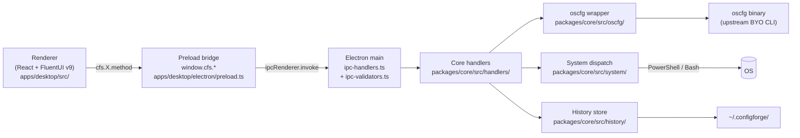
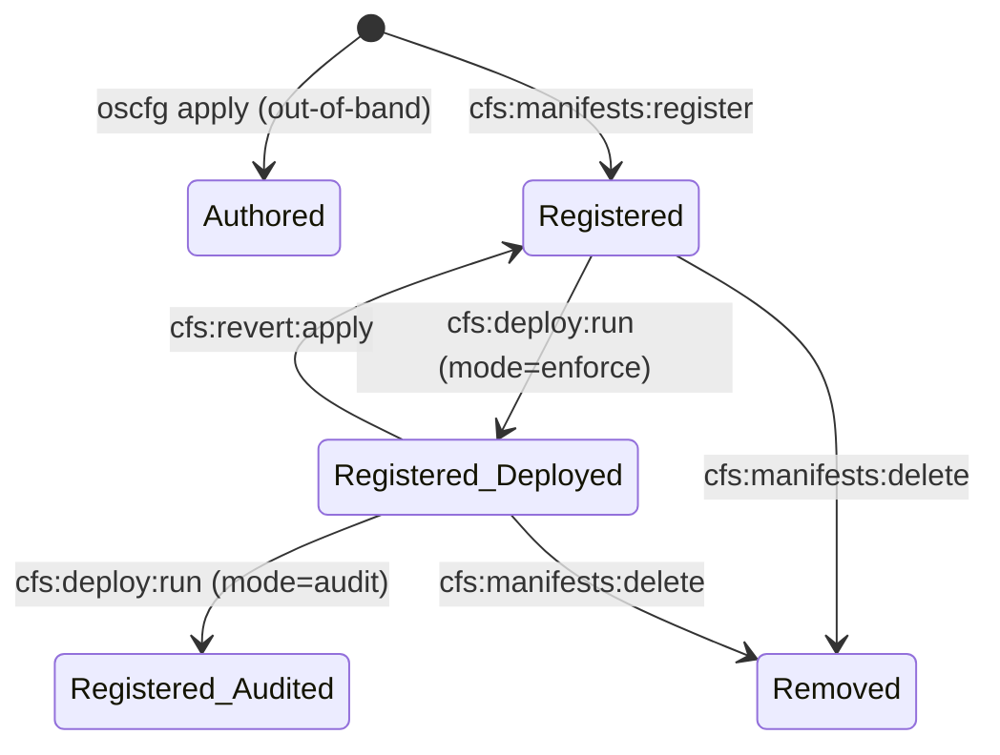
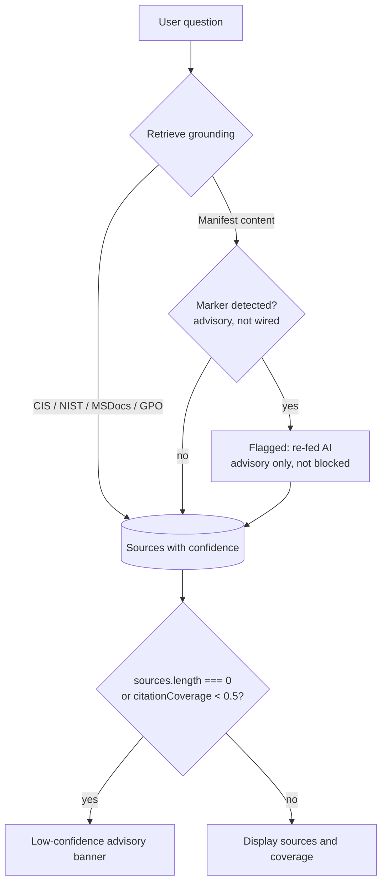
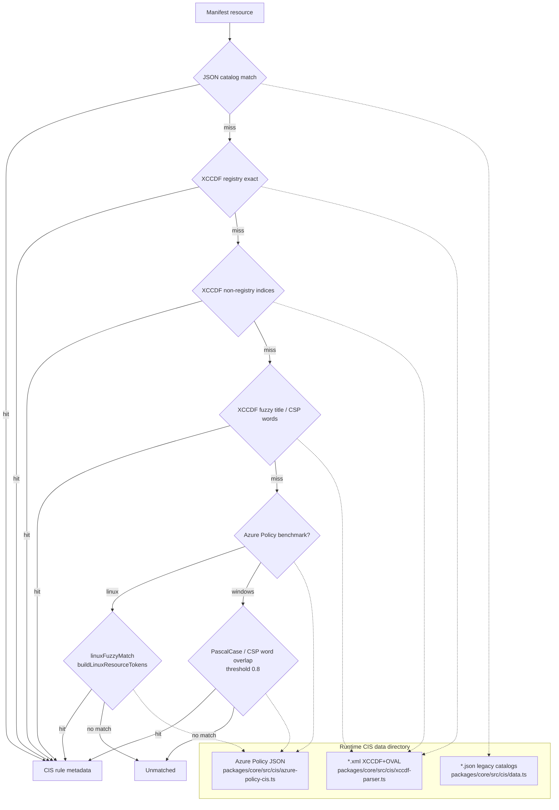

# Diagrams

Reference diagrams for the current Electron + `@configforge/core` architecture. They cover request flow, Full-edition registration/deploy states, analysis provenance, and CIS lookup. The macOS Author edition omits the device-operation namespaces shown in the deploy/audit/revert paths.

Diagrams render via the `mdbook-mermaid` preprocessor; both the
preprocessor version and the release tarball SHA256 are pinned in
`.github/workflows/docs.yml` (CF-SEC-009).

## Request flow

A renderer action crosses the preload bridge, enters Electron main IPC, then calls pure core handlers. Full-edition deploy/audit handlers use the upstream `oscfg` CLI through the core wrapper; the macOS Author exposed preload omits those namespaces.

> `packages/core/src/oscfg/runner.ts` is the operational CLI spawn choke point. Renderer code has no `child_process` access.

## Registration state machine

What a manifest can become in the Full edition and how the transitions happen.
The macOS Author edition stops at authoring, registration, history, and export.
`Authored` is the case where someone runs `oscfg apply` out-of-band;
ConfigForge picks them up via `oscfg get namespace` during the list
call when `{ live: true }` is passed.

> **Note:** `Authored` namespaces (CLI-visible but not registered)
> still appear in the list when called with `{ live: true }`. They
> go through `oscfg get resource` on demand rather than the
> disk-based fast path. Every CLI-gated transition above also has
> the v0.2.0 `CLI_REQUIRED` preflight in front of it. Deploy /
> Audit / Revert open `<CliRequiredModal />` instead of running
> when `oscfg` is missing.

## Analysis provenance + circular-guard

The diff analysis is a local heuristic (no LLM/network). Sources and
citation coverage are displayed in the analysis panel. When `sources.length === 0`
or `citationCoverage < 0.5`, the panel shows a low-confidence advisory
banner. Generated output is **labeled**
with a marker (`<!-- ai-generated:rev=N -->`) plus a spoof-resistant
per-process FNV-1a 64-bit content-hash registry (CF-SEC-007). Note: the
marker is advisory — the `assertNotAiGenerated` check is available in core
but is **not currently wired** into ingestion, so marked content is not
auto-rejected today.

> **Warning:** A response with `sources: []` is **always** advisory.
> Citation coverage affects the warning banner only.

## CIS lookup flow

The Benchmark Mapping page and CIS Diff tab resolve baseline settings against user-supplied CIS data. XCCDF is preferred when available for full-standard coverage; Azure Policy JSON is a supported fallback/source.

> The resolved CIS data directory is `<repo>/public/_baselines/cis/_data/` in dev and `<process.resourcesPath>/public-assets/_baselines/cis/_data/` in packaged builds.

## See also

- [Architecture → System overview](./system-overview.md)
- [Architecture → Registration semantics](./registration-semantics.md)
- [User Guide → Analysis provenance](../user-guide/analysis-provenance.md)
